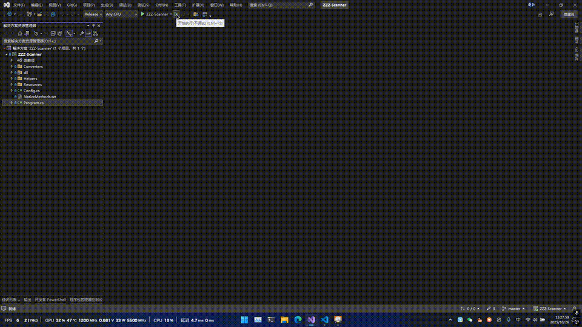

# ZZZ-Scanner

> 注意：此工具仍在开发阶段，若要使用请自行编译

- 基于 PInvoke+OnnxRuntime+OpenCv+PaddleOCR 的驱动盘导出工具
- 通过 PInvoke 调用 Win32 API 实现界面控制，并适配不同分辨率
- 通过 OnnxRuntime+OpenCv+PP-OCRv5 进行文字识别
- 通过字典和编辑距离算法实现结果纠错

## 功能

- [x] 屏幕适配
- [x] 翻页遍历
- [x] OCR 识别
- [x] 结果纠错

## 使用

1. 下载并解压
2. 打开游戏，设置简体中文+细体+16:9 的分辨率（如 1920x1080，1280x720 等）
3. 打开背包
4. 运行软件 ZZZ-Scanner.exe，会请求管理员权限，用于界面操作
5. 结果会保存到 json 中

- 扫描中按 ESC 退出背包会停止扫描
- 粗体可能影响 OCR 识别准确率
- 其他屏幕比例（如 16:10）可以先全屏游戏记录下点位，然后修改 Resources/config.json 中的配置

## 演示

